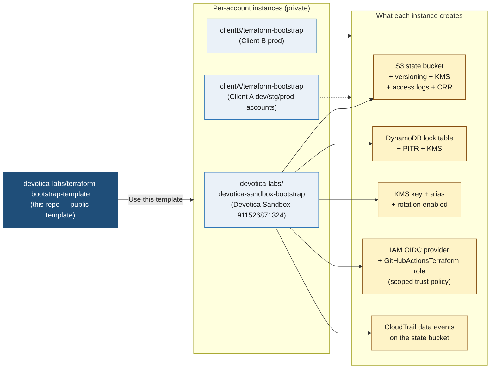

# terraform-bootstrap-template

[](LICENSE)

Reusable Terraform code that creates the foundational AWS resources every Devotica project repo needs in order to operate: state bucket, lock table, KMS key, OIDC provider, IAM role, audit trail.

> **This is the template.** It contains code only — no state, no account-specific data. Each AWS account gets its own *instance* repo (e.g. `devotica-labs/devotica-sandbox-bootstrap`, `<client-org>/terraform-bootstrap`) generated from this template.

## How it fits together



## What gets created (per account)

| Resource | Purpose |
|---|---|
| `aws_s3_bucket` (primary) | Stores `terraform.tfstate` for every project repo's every service |
| `aws_s3_bucket_versioning` | Enables state recovery (Foundation Plan §6.5) |
| `aws_s3_bucket_server_side_encryption_configuration` | SSE-KMS using the bootstrap-created key |
| `aws_s3_bucket_public_access_block` | All four block flags = true |
| `aws_s3_bucket_lifecycle_configuration` | Expires noncurrent versions after 90 days |
| `aws_s3_bucket_policy` | Denies non-TLS, denies non-KMS PutObject |
| `aws_s3_bucket` (logs) | Server-access-log target + CloudTrail destination |
| `aws_s3_bucket_replication_configuration` | Cross-region replica to `dr_region` (optional) |
| `aws_dynamodb_table` | Terraform state lock; PAY_PER_REQUEST + PITR + KMS |
| `aws_kms_key` + `aws_kms_alias` | `alias/<prefix>-terraform-state`, rotation enabled |
| `aws_iam_openid_connect_provider` | GitHub Actions OIDC federation |
| `aws_iam_role` `GitHubActionsTerraform` | Trust policy scoped per `allowed_repos` (no wildcards) |
| `aws_cloudtrail` | Data events on the state bucket → audit log |

## Multi-tenant model

| AWS account | Instance repo lives in | Owner |
|---|---|---|
| Devotica Sandbox `911526871324` | `devotica-labs/devotica-sandbox-bootstrap` | Devotica |
| Client A dev/stg/prod | `clientA/terraform-bootstrap` (separate accounts in same repo via tfvars) | Client A (Devotica is collaborator during engagement) |
| Client B prod | `clientB/terraform-bootstrap` | Client B |

**State files for client accounts live in client GitHub orgs**, not Devotica's. End-of-engagement handoff is a non-event — the client already owns the data.

## First-time use — creating a new instance from this template

### 1. Create the instance repo

In GitHub UI, click "Use this template" → "Create a new repository":

- **Owner:** `devotica-labs` (for Devotica's own accounts) or `<client-org>` (for client accounts)
- **Repo name:** `<account-purpose>-bootstrap` (e.g. `devotica-sandbox-bootstrap`) or `terraform-bootstrap` (when the org hosts only one)
- **Visibility:** **Private** (the instance contains state files)

### 2. Clone locally and configure tfvars

```bash
git clone git@github.com:<your-org>/<your-bootstrap-repo>.git
cd <your-bootstrap-repo>

# Copy the example and fill in your account_id, region, allowed_repos
cp accounts/example.tfvars accounts/<account-name>.tfvars
$EDITOR accounts/<account-name>.tfvars
```

### 3. Configure sops for state encryption

Pick one of:

- **Age key (simpler, recommended for single-engineer workflows):**
  ```bash
  age-keygen -o ~/.config/sops/age/keys.txt
  # Copy the public key (line starting with "# public key:") into .sops.yaml
  ```
- **AWS KMS (recommended for shared workflows; circular for the *first* run):**

  First run uses age, then re-key the encryption to the bootstrap-created KMS key after apply. See [`docs/state-encryption.md`](./docs/state-encryption.md).

### 4. Authenticate to the target AWS account

Use Identity Center, `aws sso login`, or whatever your org's pattern is. The session needs admin rights to create IAM, KMS, S3, DynamoDB, CloudTrail.

```bash
aws sts get-caller-identity   # confirm you're in the right account
```

### 5. Run terraform — **first run uses local backend**

```bash
# Init points at a per-account local state path so re-runs for different
# accounts don't collide.
terraform init -backend-config="path=state/<account-name>.tfstate"

terraform plan  -var-file=accounts/<account-name>.tfvars
terraform apply -var-file=accounts/<account-name>.tfvars
```

Apply takes ~3–5 min. You'll see ~25 resources created.

### 6. Encrypt the state file and commit

```bash
./scripts/encrypt-state.sh <account-name>
rm state/<account-name>.tfstate          # remove the plaintext copy
git add state/<account-name>.tfstate.encrypted
git commit -m "chore(<account-name>): bootstrap state"
git push
```

`state/*.tfstate` is gitignored — only `*.tfstate.encrypted` is committed.

### 7. Capture outputs for downstream consumers

```bash
terraform output -json > docs/<account-name>-outputs.json
git add docs/<account-name>-outputs.json
```

The most important values for project repos:

```bash
terraform output state_bucket_name
terraform output lock_table_name
terraform output kms_key_alias
terraform output github_actions_role_arn
```

These go into every consumer repo's `backend.hcl` and the `aws-role-arn` workflow input.

## Re-running bootstrap (e.g. to update IAM trust policy)

```bash
./scripts/decrypt-state.sh <account-name>
terraform init -backend-config="path=state/<account-name>.tfstate"
terraform plan  -var-file=accounts/<account-name>.tfvars
terraform apply -var-file=accounts/<account-name>.tfvars
./scripts/encrypt-state.sh <account-name>
rm state/<account-name>.tfstate
git add state/<account-name>.tfstate.encrypted
git commit -m "feat(<account-name>): expand allowed_repos to include terraform-aws-rds"
git push
```

## Disaster recovery

If the state bucket or this repo's state is lost, see [`docs/disaster-recovery.md`](./docs/disaster-recovery.md). TL;DR:

- **State bucket gone, CRR replica intact** → restore from CRR target, update `terraform-bootstrap` backend to point at the replica
- **CRR target also gone** → re-run bootstrap with `terraform import` for each resource (90-min job, runbook in `docs/`)
- **Local encrypted state lost but bucket + role intact** → consumer projects keep working; re-run bootstrap to reconstruct

## Security model

- IAM role has **no managed policies attached by default**. Each consumer repo (or the account owner) attaches what it actually needs. Foundation Plan §11.5 — least-privilege.
- OIDC trust uses **scoped `sub` claims**, never wildcards. Foundation Plan §6.4.
- S3 bucket policy **denies non-TLS** and **denies non-KMS PutObject**. Defense in depth.
- KMS key rotation is **enabled by default** with a 30-day deletion window.
- CloudTrail data events on the state bucket → every read/write of state is audited.

## Versioning

Strict semver via Git tags. Consumers (i.e., the per-account instance repos) pin to a major version when they fork:

- `@v1` — auto-tracks latest `v1.x.y`, recommended
- `@v1.2.3` — exact pin, useful when investigating regressions

Breaking changes (renaming a variable, changing a resource's address, raising the minimum Terraform version) trigger a major bump.

## License

Apache-2.0. See [LICENSE](./LICENSE).
